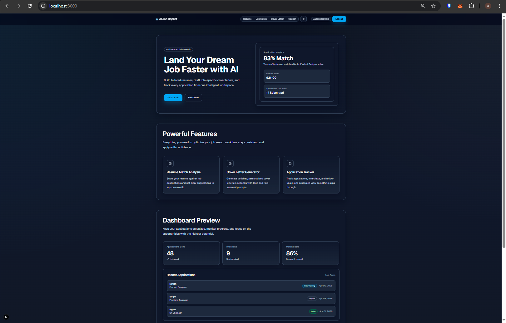
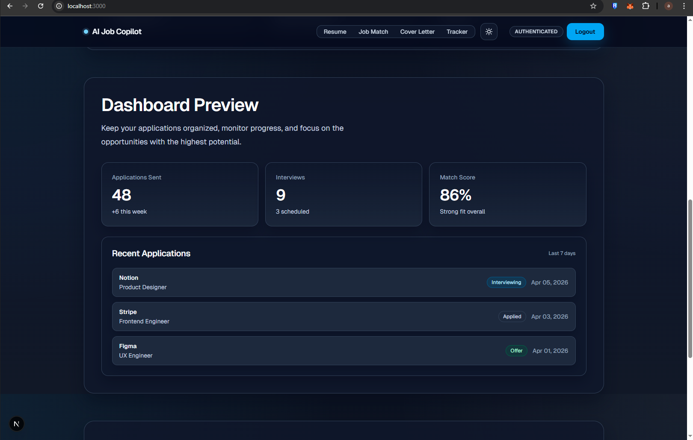
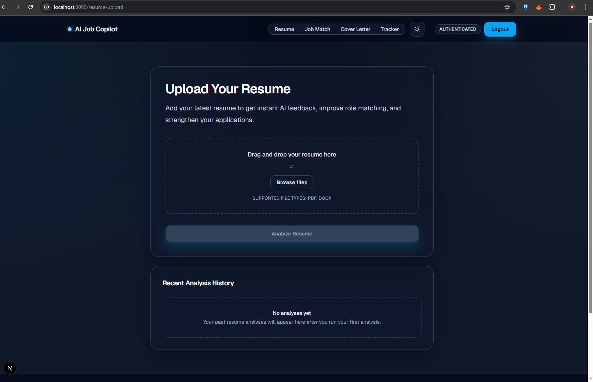
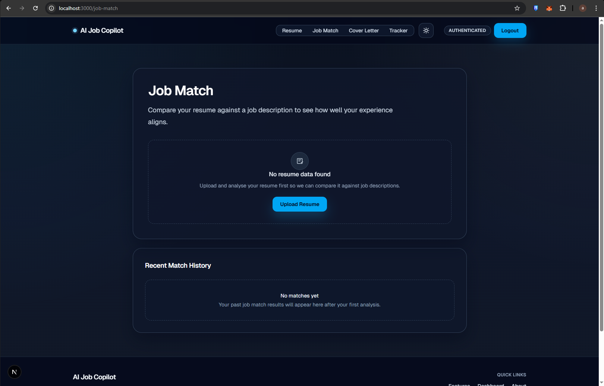
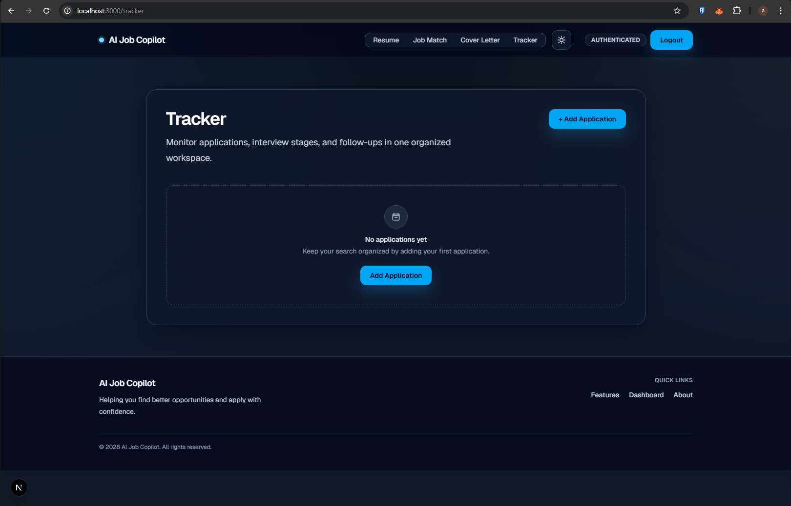

# HireFlow AI

HireFlow AI is a production-ready career workflow platform that helps job seekers move faster with high-quality applications. It combines resume analysis, job-match scoring, tailored cover letter generation, and application tracking in one clean experience.

Built for practical use and portfolio impact, the project demonstrates modern full-stack engineering with robust client-side UX states, Supabase-backed data workflows, and deployment readiness for Vercel.

## Project Overview

HireFlow AI streamlines the most time-consuming parts of job searching:

- Resume analysis with actionable improvement suggestions
- Job description matching with skills gap insights
- AI-assisted cover letter generation aligned to role and company
- Application tracker with authenticated per-user history

The app is designed to showcase both product thinking and reliable engineering execution.

## Key Features

- Secure authentication flow with login, signup, forgot password, and password reset
- Resume upload and analysis API with user-friendly validation and error handling
- Job match scoring with missing-skill detection and reusable match history
- Cover letter generation with form validation, success feedback, and API fallback handling
- Application tracker with create, update, delete, and status management
- Deployment-safe state handling across loading, empty, error, and success UI states

## Tech Stack

- Frontend: Next.js 16 (App Router), React 19, TypeScript
- Styling: Tailwind CSS 4
- Backend and Auth: Supabase (Auth + Postgres)
- APIs: Next.js Route Handlers
- Deployment: Vercel

## Screenshots

### Homepage



### Dashboard



### Resume Workflow



### Job Match



### Tracker



## Environment Variables

Create a `.env.local` file in the project root with:

```bash
NEXT_PUBLIC_SUPABASE_URL=https://your-project.supabase.co
NEXT_PUBLIC_SUPABASE_ANON_KEY=your-anon-key
```

Notes:

- Use the Supabase anon key (public key), not the service role key
- Keep real credentials out of version control
- The same variables must be added to Vercel project settings for production

## Local Setup

```bash
git clone https://github.com/Ewonn18/hireflow-ai.git
cd hireflow-ai
npm install
```

Then configure `.env.local` as shown above.

## How to Run

Start development server:

```bash
npm run dev
```

Build and run production locally:

```bash
npm run build
npm run start
```

## How to Deploy on Vercel

1. Push this repository to GitHub
2. Import the repo into Vercel
3. Add environment variables in Project Settings -> Environment Variables:
   - `NEXT_PUBLIC_SUPABASE_URL`
   - `NEXT_PUBLIC_SUPABASE_ANON_KEY`
4. Redeploy after saving env vars
5. Verify authentication and core flows in production

## Folder Structure

```text
app/
	api/
		analyze-resume/
		cover-letter/
		job-match/
	components/
	context/
	cover-letter/
	forgot-password/
	job-match/
	lib/
	login/
	resume-upload/
	signup/
	tracker/
	update-password/
public/
screenshots/
```

## Future Improvements

- Add role-specific prompt tuning for deeper cover letter personalization
- Add analytics dashboard for conversion and interview-rate tracking
- Add automated test coverage for critical auth and API flows
- Add observability integration (error tracking and performance monitoring)
- Add team-ready CI checks for lint, type, and build validation
